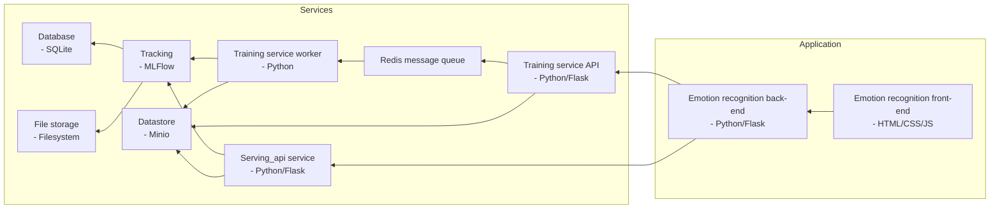

# CHIMP

CHIMP (Continuous Hypothesis and Information Mending Pipeline) is a project that aims to give a reference for operating
a continual AI pipeline. It was originally part of a bachelor thesis project by Bryan Kroon.

## Components

- **serving_api:** Responsible for serving the model for inference. This is done using a REST API.
- **training:** Responsible for training the model and logging the results. The resulting model and logs are
  stored into MLFlow.
- **ml-frontend:** A web-application that is responsible for managing the interaction with the user (note: while it is
  called "front-end", it also contains a back-end component in the form of a Flask API that communicates with the rest
  of the CHIMP system).
- **mlflow-tracking:** MLFlow is used to track the different models and log metrics for these models.
- **minio-datastore:** Minio is used as a centralized datastore for storing and managing datasets.
- **message-queue:** Redis is used as a message queue to coordinate jobs between the APIs and the workers.

The table below shows which ports are used by the different components. The "Local Dev Port" is the port that is used when a component is run on the host instead of in Docker.

| Component        | Local Dev Port | Docker Host Port | Docker Internal Ports |
|------------------|----------------|------------------|-----------------------|
| serving_api      | 5254           | 5254             | 8000                  |
| training         | 5253           | 5253             | 8000                  |
| ml-frontend      | 5252           | 5252             | 8000                  |
| mlflow-tracking  | n.a.           | 8999             | 8999                  |
| minio-datastore  | n.a.           | 9000, 9001 (web) | 9000, 9001            |
| message-queue    | n.a.           | 6379             | 6379                  |

## Development setup

1. Fork this repository and clone the fork to your local machine.
2. Install Docker and Docker Compose.
3. [OPTIONAL] Download the docker-data.zip [here](https://drive.google.com/file/d/1ILWH1V4SOSCMbYuRBi4xylDAPRm3WG0B/view?usp=sharing) and extract it into the docker-data folder
4. Run `docker-compose up` in the root of the repository
   - On some systems you need to run `docker-compose --profile '' up` instead to run the default profile
5. Open your browser and navigate to the datastore dashboard on `http://localhost:9001`
6. On the datastore dashboard, go to "Access Keys" and click on "Create access key"
7. Add the access key and secret key created here to the `.env` file in the root of the CHIMP project
8. Open your browser and navigate to `http://localhost:5252`
9. Allow the CHIMP front-end to use your webcam.
10. Click on browse and select the calibration-data.zip (which can be downloaded on Teams).
11. Click on "Train New Model" and wait for the training to finish.
    - You can monitor the training progress in the terminal by running `docker logs -f experimentation-server`.
12. Once the training is finished, navigate to `http://localhost:8999` (MLFlow).
13. Click on "Models" and select "onnx emotion model".
14. Click on the last model and set the model to "Production" by changing the "stage" setting at the top of the screen.  
    - [OPTIONAL] Click on the second to last model and sit the model to "Staging" by changing the "stage" setting at the top of the screen.
15. Refresh the CHIMP front-end. You should now see percentages of the detected emotions.

To run the GPU enabled version of CHIMP use the "gpu" profile as follows: `docker-compose --profile gpu up -d`. To only
run the external services, such as MLFlow and RabbitMQ (e.g. when running the Python code directly on the host), use the "services" profile as
follows: `docker-compose --profile services up -d`. Please note that the `--profile <PROFILE_NAME>` should come before any
further commands, such as `up -d`. On some setups, to use the default profile (denoted by an empty string, or ''), it should be explicitly included in the call, for example: `docker-compose --profile '' up -d`.

To monitor and work with the Redis message queue during development, a tool like "Another Redis Desktop Manager" can be used.

### Local development setup (on host outside of Docker)
To run the Python/Flask based CHIMP components outside of Docker (for example, when you want to run a component with a debugger attached), you can use the following steps:
- Run the MLFlow service in Docker using `docker-compose --profile services up -d`
- Open your browser and navigate to the datastore dashboard on `http://localhost:9001`
- On the datastore dashboard, go to "Access Keys" and click on "Create access key"
- Add the access key and secret key created here to the `.env` file in the root of the CHIMP project
- Create a virtual environment using Python 3.11 with the command `python3.11 -m venv env`
- Activate the virtual environment:
    - Linux: `source env/bin/activate`
    - Windows: `env\Scripts\activate`
- Install the dependencies for each component using said components' `requirements.txt` file while the virtual environment is activated:
  - Training: `pip install -r training/requirements.txt`
  - Serving_api: `pip install -r serving_api/requirements.txt`
  - ML-frontend: `pip install -r ml-frontend/requirements.txt`
- Install the development dependencies for each component using said components' `requirements-dev.txt` file while the virtual environment is activated:
  - Training: `pip install -r training/requirements-dev.txt`
  - Serving_api: `pip install -r serving_api/requirements.txt`
- Install the plugin dependencies for the training component using the `plugin-requirements.txt` file while the virtual environment is activated:
  - Training: `pip install -r training/plugin-requirements.txt` 
- Each component can now be run as usual
  - In PyCharm, a "Compound" run configuration can be used to run all the configurations for each component at once (including debugging)
- In the terminal, you can run each component whilst _being in the component directory_ (i.e. `cd experimentation`) using the following commands:
  - Training (API): `python3 manage.py run`
  - Training (worker): `celery -A manage:celery_app worker`
  - Serving_api: `python3 manage.py run`
  - ml-frontend: `python3 main.py`

## Training Plugin Development
This section of the readme contains some instructions on how to develop a new plugin (currently only used by the training component). Creating a new plugin generally contains the following steps:
1. Create a new directory in `training/app/plugins`
2. In this directory create a `__init__.py` file (this denotes a module in Python)
3. In the `__init__.py` file, import `app.plugin.BasePlugin` and `app.plugin.PluginInfo`, and create a class that inherits from this `BasePlugin`
4. Implement at least the `init() -> app.plugin.PluginInfo` and `run(*args, **kwargs) -> Optional[str]`
   - `init() -> app.plugin.PluginInfo` should at least fill the plugins `self._info` attribute with a `app.plugin.PluginInfo` object (see [section "filling PluginInfo"](#filling-plugininfo)), and can be used for any initialization (optionally this can also be done in the `__init__()` method), but should at least return the `self._info` attribute
   - `run(*args, **kwargs)` can contain any Python code used to run the plugin, this includes call functions or creating classes outside the `__init__.py` file
5. [OPTIONAL] Add any (Python/pip) requirements to the `plugin-requirements.txt` file under its' own heading
6. [OPTIONAL] When using a previous model for continuous learning, it can be loaded by using the `self._connector.get_production_model()` method, this method takes a number of arguments:
   - **save_to:** The path to save the downloaded model to (this should be inside the temp folder provided to the plugin
   - **model_name:** The name of the model to download
   - **experiment_name:** Name of the experiment to load a model for
8. [OPTIONAL] When the plugin trains a model, it can be saved using the `self._connector.store_model()` method, this method takes a number of arguments:
   - **experiment_name:** [str] The experiment name to use (unless a `model_name` is specified, this is also used as the model name)
   - **model:** [any] The model object
   - **model_type:** [str] The type of model (e.g. `"tensorflow"` or `"onnx"`)
   - **model_name:** [Optional[str]] The name of the model (if no name is specified, the `experiment_name` is used)
   - **hyperparameters:** [Optional[Dict[str, any]]] An optional parameter that can be used to store the hyperparameters used with the model
   - **metrics:** [Optional[Dict[str, any]]] An optional parameter that can be used to store any measured metrics with the model (e.g. accuracy)
   - **tags:** [Optional[Dict[str, str]]] An optional parameter that can be used to add tags

The `training/app/plugins` folder contains a number of example implementations.

### Filling PluginInfo
Every plugin has a `_info` attribute, which should be filled with a `app.plugin.PluginInfo` object. This object contains any important information about the plugin. The `PluginInfo` object has the following fields:
- **name:** The name of the plugin. This is also the names used when starting the task using the `/tasks/run/<plugin_name>` endpoint.
- **version:** The version of the plugin. No version scheme is enforced.
- **description:** A description of the plugin
- **arguments:** A dictionary containing the arguments expected by this plugin. Note that these expected arguments are currently not checked. Each argument uses the argument name as a key and the value is a dictionary containing the following:
  - **name:** Name of the argument (should be the same as the key).
  - **type:** The type of the argument. It is encouraged to use the Python type hinting format here, but this is not enforced. Note that checking if a argument has the correct type and converting it from a string to said type is the responsibility of the plugin implementor.
  - **description:** A description of the argument.
  - **optional:** [OPTIONAL] This is an optional field to denote that an argument is optional, if it is not present (or explicitly set to False), it is assumed that an argument is not optional (i.e. required).
- **datasets:** A dictionary containing the datasets expected by this plugin. Each dataset value is a dictionary with the following fields:
  - **name:** Name of the dataset (this should be the same as the key)
  - **description:** A description of the dataset. It is encouraged to give a detailed description of the dataset, the format, the hierarchy, etc. in this field.
  - **optional:** [OPTIONAL] This is an optional field to denote that a dataset is optional, if it is not present (or explicitly set to False), it is assumed that a dataset is not optional (i.e. required).
- **model_return_type:** The type of model returned by the plugin. If no model is returned, it should be set to `None`

## Security notes
- If you host CHIMP in a publicly available manner, ensure that you replace the preconfigured datastore key and secret with your own key and secret.
