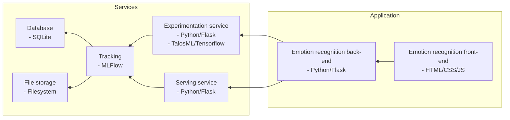

# CHIMP
CHIMP (Continuous Hypothesis and Information Mending Pipeline) is a project that aims to give a reference for operating a continual AI pipeline. It was originally part of a bachelor thesis project.

## Components
- **serving:** Responsible for serving the model for inference. This is done using a REST API.
- **experimentation:** Responsible for training the model and logging the results. The resulting model and logs are stored into MLFlow.
- **ml-frontend:** A web-application that is responsible for managing the interaction with the user (note: while it is called "front-end", it also contains a back-end component in the form of a Flask API that communicates with the rest of the CHIMP system).
- **mlflow-tracking:** MLFlow is used to track the different models and log metrics for these models.

## Development setup
1. Fork this repository and clone the fork to your local machine.
2. Install Docker and Docker Compose.
3. Run `docker-compose up` in the root of the repository.
4. Open your browser and navigate to `http://localhost:5252`.
5. Allow the CHIMP front-end to use your webcam.
6. Click on browse and select the calibration-data.zip (which can be downloaded on Teams).
7. Click on "Train New Model" and wait for the training to finish.
   - You can monitor the training progress in the terminal by running `docker logs -f experimentation-server`.
8. Once the training is finished, navigate to `http://localhost:8999` (MLFlow).
9. Click on "Models" and select "onnx emotion model".
10. Click on the last model.
11. Set the model to "Production" by changing the "stage" setting at the top of the screen.
12. Refresh the CHIMP front-end. You should now see percentages of the detected emotions.

To run the GPU enabled version of CHIMP use the "gpu" profile as follows: `docker-compose --profile gpu up -d`. To only run MLFlow (e.g. when running the Python code directly on the host), use the "mlflow" profile as follows: `docker-compose --profile mlflow up -d`. Please note that the `--profile <PROFILE_NAME>` should come before any further commands, such as `up -d`.
