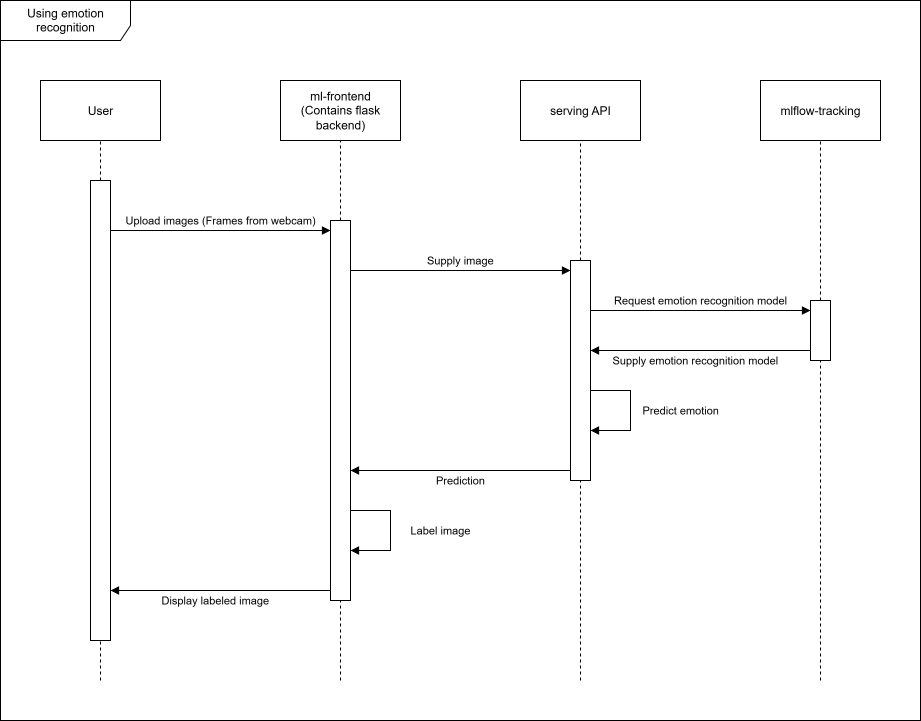
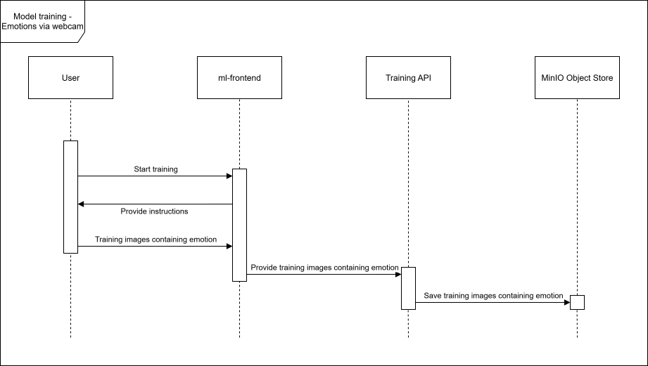
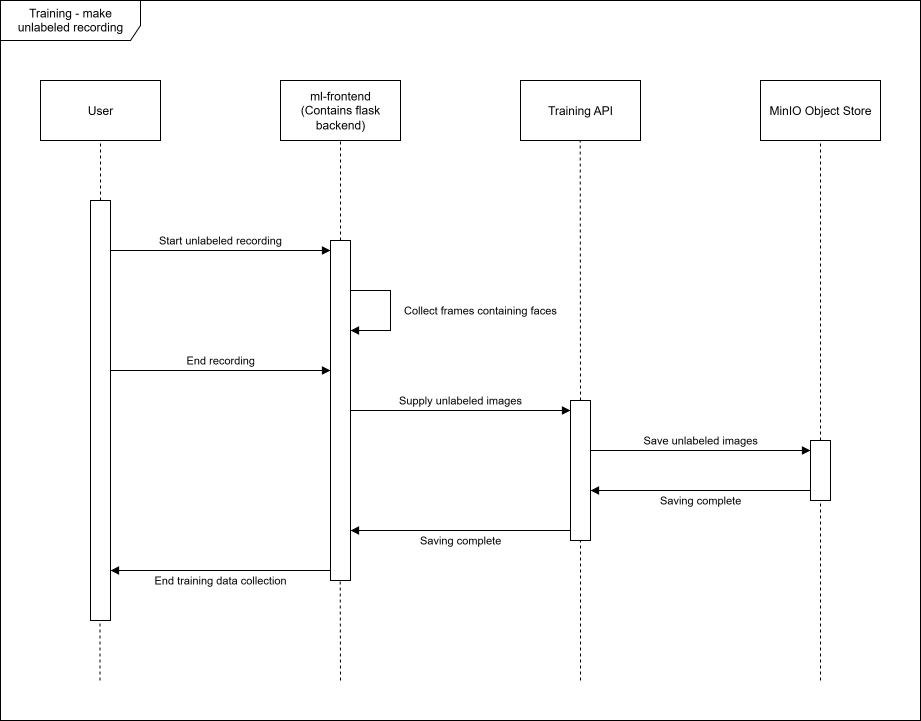
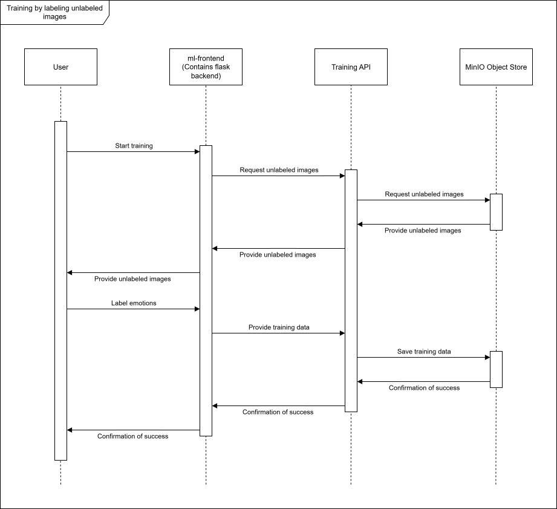
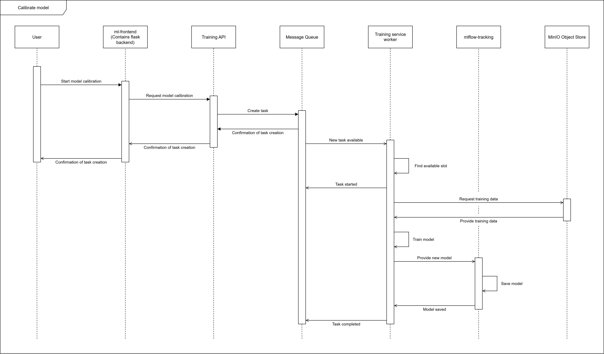

# CHIMP diagrams

This README contains sequence diagrams detailing some of the different use cases of CHIMP.

## Using emotion recognition

## Training by showing emotions via webcam

## Making an unlabeled recording

## Labeling unlabeled images

## Calibrating the model

